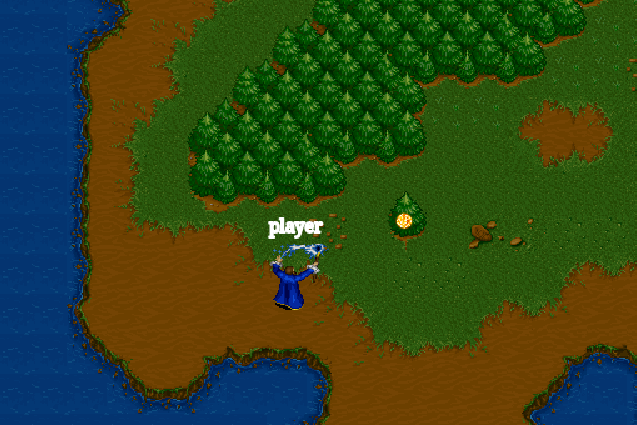
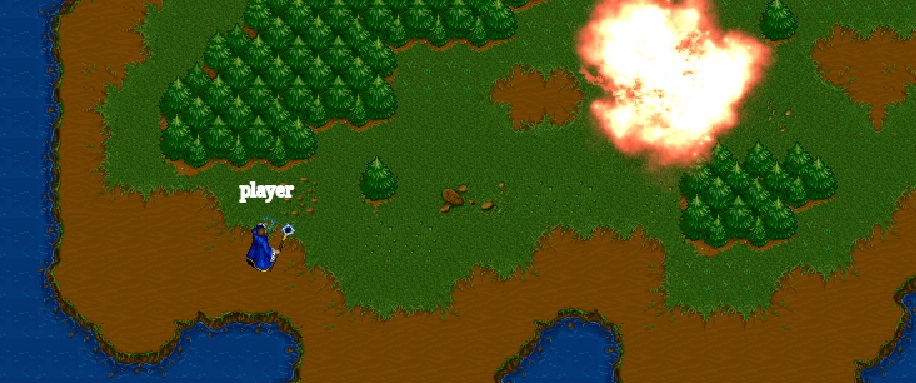

<h1 align="center">
  <br>
  
  <br>
  Multiplayer 2D RPG Game - Built by Krishnansh Vasaniya
  <br>
</h1>

<h4 align="center">
This project is an enhanced and customized version of an open-source Phaser 3 React RPG template, extended with new features and personalization.
</h4>

<p align="center">
  <a href="https://opensource.org/licenses/MIT" title="License: MIT" >
    
  </a>
</p>

<p align="center">
  <a href="#features">Features</a> •
  <a href="#preview">Preview</a> •
  <a href="#getting-started">Getting Started</a> •
  <a href="#customization-done">Customization Done</a> •
  <a href="#technologies-used">Tech Stack</a> •
  <a href="#credits">Credits</a>
</p>

---

## 🚀 Features

- Real-time multiplayer support using WebSockets (Socket.IO)
- Interactive 2D RPG world built with Phaser 3
- React.js-based UI controls and layout
- Tilemaps, sprite movement, and basic collision
- Clean folder structure with Webpack and TypeScript

---

## 🖼️ Preview




---

## 🛠️ Getting Started

### Prerequisites

Make sure you have the following installed:

- Node.js
- Git

### Installation

```bash
# Clone this repository
git clone https://github.com/YOUR_USERNAME/YOUR_REPO_NAME.git

# Navigate into the project folder
cd YOUR_REPO_NAME

# Install dependencies
npm install

# Start the development server (on port 3001)
npm start
